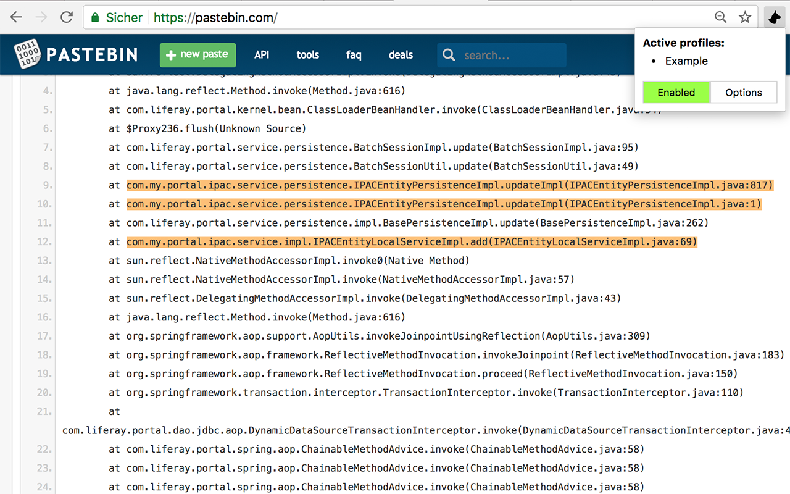
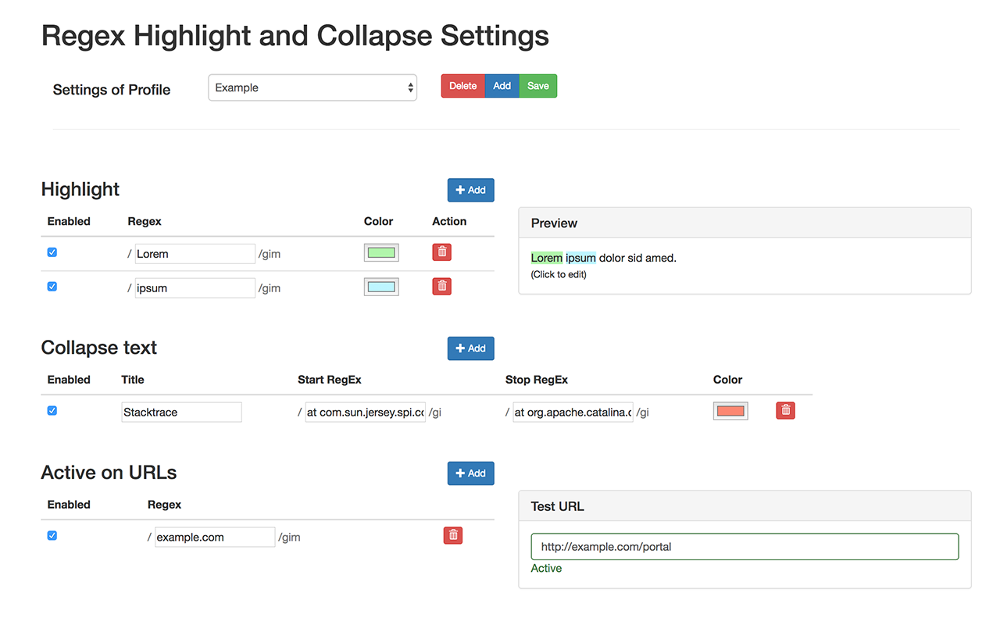

# Rex - Highlight or Collapse Text

This extension allows to use regular expressions to highlight or collapse text on a web page. It was developed to facilitate log analysis (e.g. highlight important parts of stacktraces, collapsing framework noise)

## Features

- Use regex to highlight text
- Use regex to collapse text
- Define different colors for each regex
- Profiles to organize regex in groups 
- Url matcher to define on which pages profile should be active
- Temporarily enable/disable regex

## Todo

- Allow to collapse text that contains other dom nodes (e.g. span for styling, images, ...)
- Export settings and import them from URL (e.g. store settings in git with code)
- (Auto?)-update imported settings
- Execute custom JS

## Why Rex?

The name is inspired by the austrian tv show "Inspector Rex". The main character, a german shephard named Rex, is a police dog that helps find evidence and solve crimes (https://en.wikipedia.org/wiki/Inspector_Rex).

## Screenshots

**Extension active**

**Extension options**

## Credits

This extension was inspired by [linkuha/ext-resh](https://github.com/linkuha/ext-resh). 